# Dhaka Tesla Pool

**Share a seat. Split the fare. Survive Dhaka traffic.**

[](https://github.com/shopnil13/dhaka_tesla_pool/actions/workflows/ci.yml)

A ride-pooling MVP. Passengers going the same way share one three-seat Tesla
(Jashim's _Bullet_), each pays their own upfront fare, and the seat count holds
even when two people grab the last seat at the same instant.

|               |                                                               |
| ------------- | ------------------------------------------------------------- |
| **Live demo** | **https://dhaka-tesla-pool-shopnil.vercel.app**               |
| API health    | https://dhaka-tesla-pool-api-iw7d.onrender.com/api/v1/health  |
| Demo video    | _link added after recording_                                  |
| Stack         | Next.js 16 · Express 5 · PostgreSQL 17 · Drizzle · TypeScript |

> **First visit may take up to a minute.** The API runs on Render's free tier
> and sleeps after 15 idle minutes; the app shows "Waking up Bullet's engine…"
> while it starts.

**Demo accounts** (password for all: `TeslaPool@2026`)

| Who    | Email                   | Role      | Notes                                                     |
| ------ | ----------------------- | --------- | --------------------------------------------------------- |
| Nusrat | `nusrat@teslapool.test` | Passenger | TeslaPay ৳500 (৳428 after yesterday's seeded ride)        |
| Rafiq  | `rafiq@teslapool.test`  | Passenger | ৳300; yesterday's ride is waiting for his rating          |
| Shirin | `shirin@teslapool.test` | Passenger | Only ৳50, so a ৳72 TeslaPay ride is refused (cash works)  |
| Jashim | `jashim@teslapool.test` | Driver    | Drives Bullet `DHAKA-TESLA-11`, 3 seats, parked at Banani |

The login page has one-click buttons that fill in each email. Use a private
window for the second person (each window keeps its own session).

---

## Contents

1. [The problem](#1-the-problem)
2. [What's implemented](#2-whats-implemented)
3. [Screenshots](#3-screenshots)
4. [Architecture](#4-architecture)
5. [Database and ERD](#5-database-and-erd)
6. [Pooling, fares and cancellation rules](#6-pooling-fares-and-cancellation-rules)
7. [Concurrency: the last seat](#7-concurrency-the-last-seat)
8. [Tech choices and why](#8-tech-choices-and-why)
9. [Project structure](#9-project-structure)
10. [Running it](#10-running-it)
11. [Tests](#11-tests)
12. [API overview](#12-api-overview)
13. [Deployment](#13-deployment)
14. [Key decisions and trade-offs](#14-key-decisions-and-trade-offs)
15. [Known limitations](#15-known-limitations)
16. [Next improvements](#16-next-improvements)
17. [Git workflow](#17-git-workflow)
18. [AI usage](#18-ai-usage)
19. [Bonus: if Oi Tesla goes viral](#19-bonus-if-oi-tesla-goes-viral)

---

## 1. The problem

Three strangers leave Banani at rush hour: Nusrat to Mohakhali, Rafiq to
Gulshan 1, Shirin to Gulshan 2. Three separate cars cost three fares and add
three cars to the jam. One car with three seats could take them all, **if**
their trips overlap enough that nobody is dragged far out of their way, each
pays only for their own trip, and nobody finds themselves in a car they didn't
agree to.

So the product has to decide **who can share** (same pickup, small detour),
**what each person pays** (fair, known up front, never more than quoted),
**what happens when plans change** (cancellations, a driver calling it off),
and it has to stay **correct under concurrency**: Bullet has three seats, and
that must hold even when two requests race for the last one.

Assumptions I made where the brief was open (all enforced in code and tests):

- Geography is **9 predefined Dhaka zones** with a fixed road-distance matrix
  instead of maps, so every fare can be checked by hand.
- **Drivers are seeded**; only passengers sign up. One Tesla per driver, one
  active pool per driver, one active ride per passenger.
- A pool takes new riders only **until the driver arrives** at the pickup.
- Passengers see **how many** people share their car, never their names or
  fares. The driver sees everyone (names, drop-off order, cash to collect).

## 2. What's implemented

**Passenger**

- Sign up / sign in; live **upfront fare** while choosing zones, seats, share
  or solo, cash or TeslaPay ("৳72 · could drop to ৳63 if the Tesla fills up").
- Request a ride; if sharing, it is **auto-matched** into a compatible Tesla
  already leaving from the same area, otherwise it waits in drivers' feeds.
- Live status (polled every 3 s): requested → matched → driver arrived → on
  the way → completed, with drop-off position and co-rider count.
- **Cancel**: free until the driver arrives, ৳30 after, not possible once riding.
- **Ride history**, each ride with its frozen fare breakdown, payments and a
  plain-language **timeline** ("Jashim arrived at Banani", "Paid ৳72 by TeslaPay").
- **Rate** the driver (1–5 stars + comment) once, after drop-off; see the
  driver's average when matched.
- **TeslaPay** wallet (simulated): balance, top-up, append-only ledger,
  outstanding cash fees.

**Driver (Jashim)**

- Go online/offline and choose the waiting zone.
- Request feed for that zone, each with **"fits / doesn't fit, and why"**
  ("Sharing would add 3 km to someone's trip (limit 2 km)").
- Accept (joins the current pool or starts one) → arrived → start → drop off
  each passenger in the suggested order; sees seats, fares and **cash to collect**.
- Cancel a pool before it starts (passengers go back to the queue for free).
- Trip history with earnings, each rider's outcome, stars and comments.

**Platform**

- Seats can never exceed capacity: row lock **and** a database CHECK
  (proven by a race test that fails when the lock is removed).
- Two state machines (pool and ride) with every transition validated and
  written to an append-only audit trail.
- Money in integer poisha; fares frozen when the trip starts and never above
  the quote.
- `docker compose up` runs everything (migrations and seed included);
  deployed for free on Vercel + Render + Neon; CI on every push.

## 3. Screenshots

All taken by [`scripts/screenshots.mjs`](scripts/screenshots.mjs), which plays
the demo story in a real browser against the Docker build.

|                                                                                                                                     |                                                                                                                                     |
| ----------------------------------------------------------------------------------------------------------------------------------- | ----------------------------------------------------------------------------------------------------------------------------------- |
| 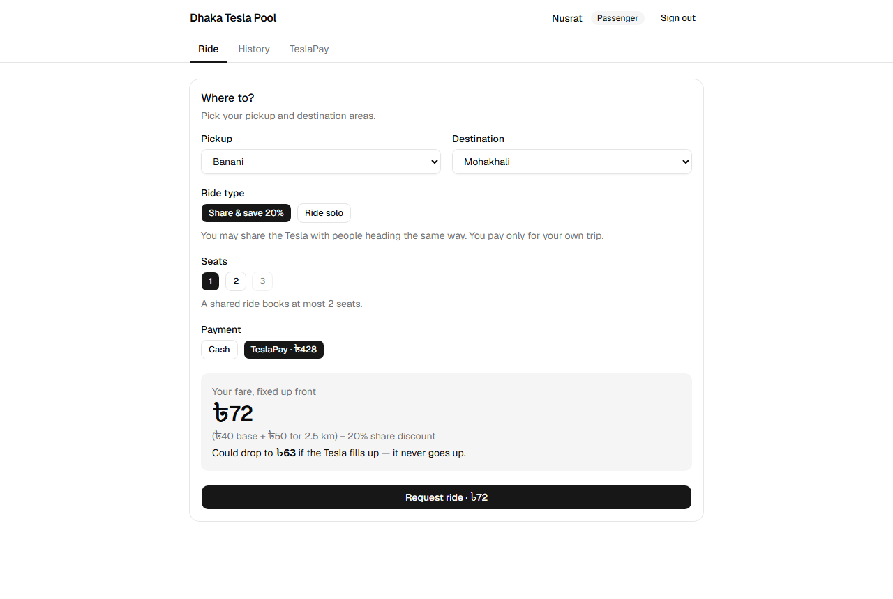 **Nusrat's upfront fare**: ৳72 shared, could drop to ৳63             | 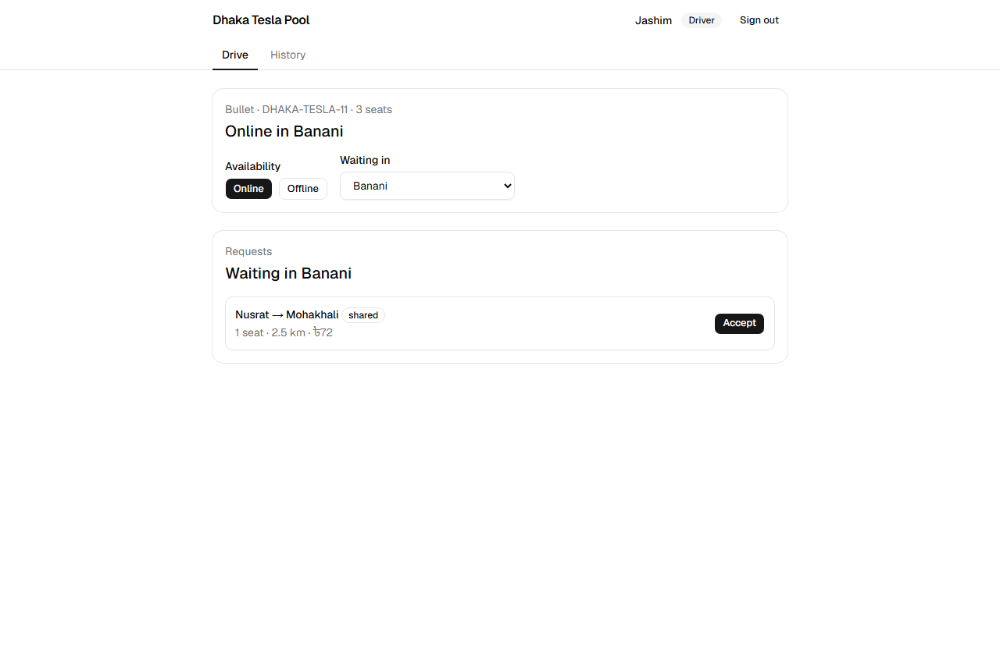 **Jashim online at Banani** sees Nusrat's request                     |
| 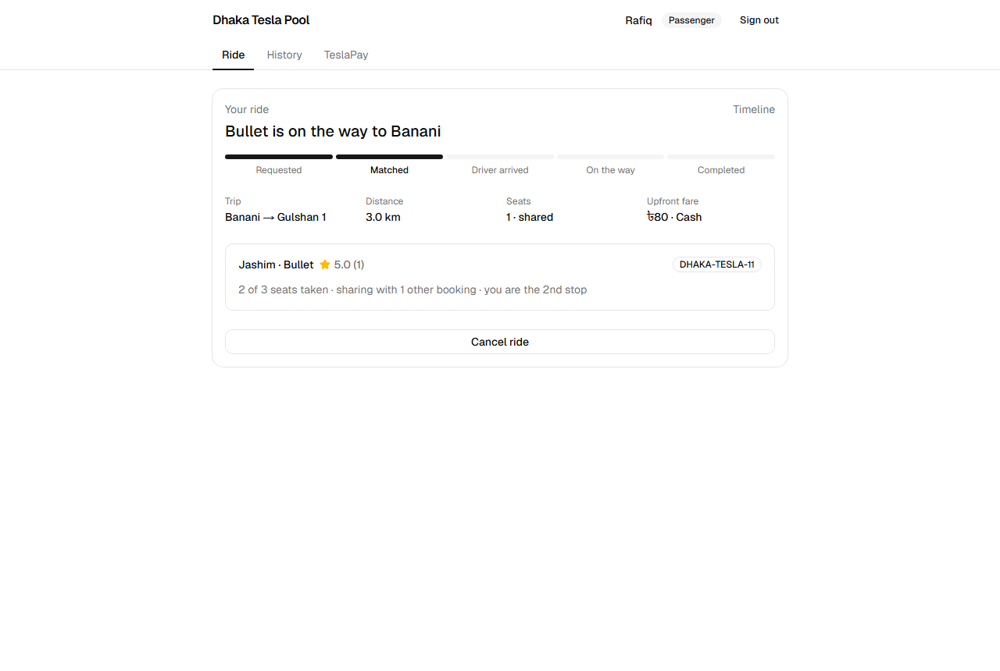 **Rafiq is auto-matched** into Bullet: 2nd stop, sharing with 1 booking | 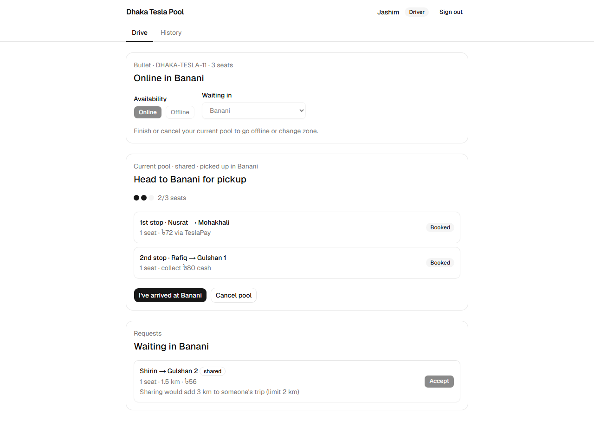 **The pool**, drop-off order and cash to collect; Shirin doesn't fit (detour) |
| 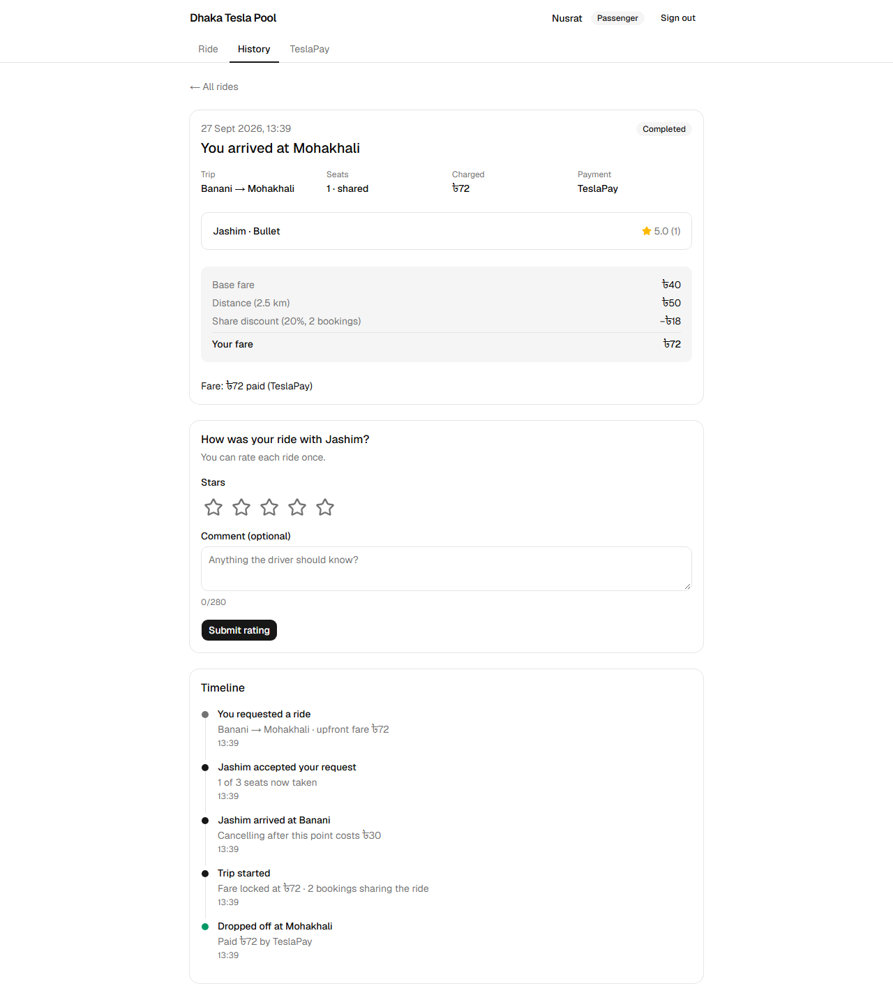 **After drop-off**: frozen fare breakdown, rating, timeline                         | 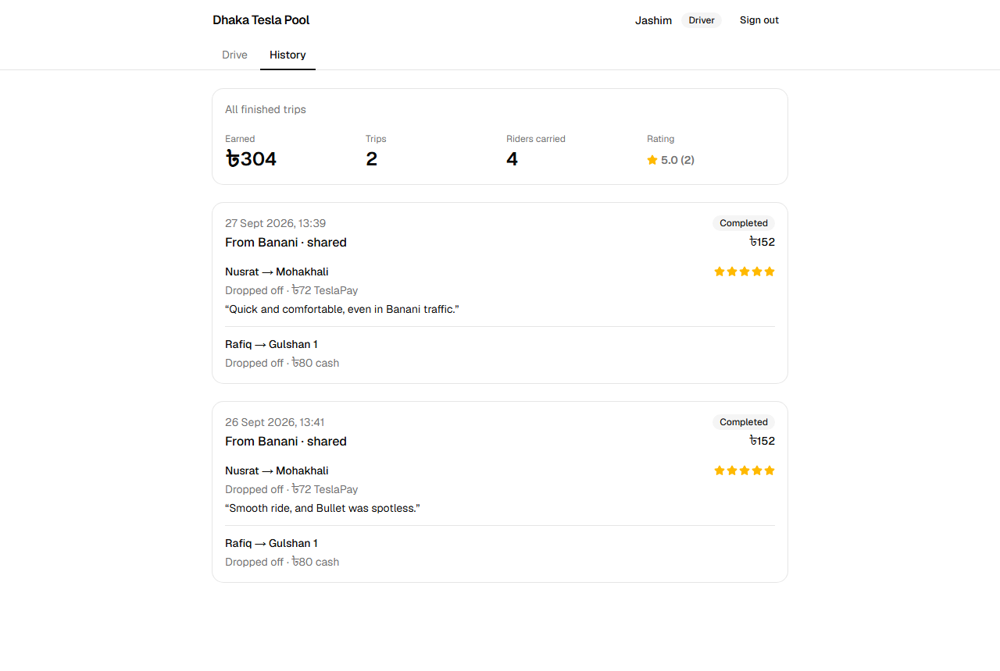 **Jashim's history**: earnings, stars and comments                        |
| 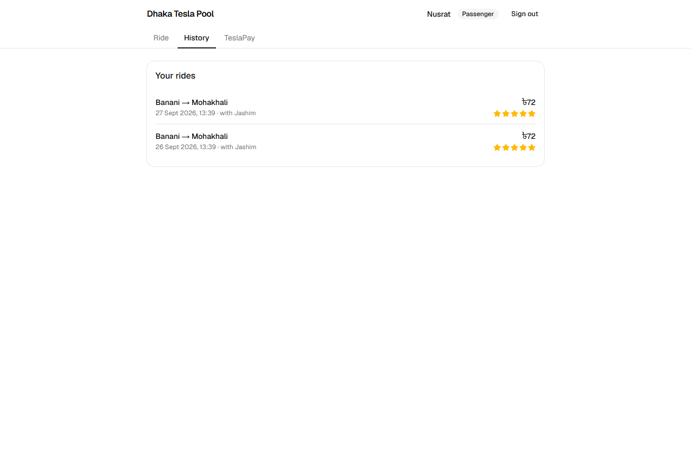 **Nusrat's rides**                                                  | 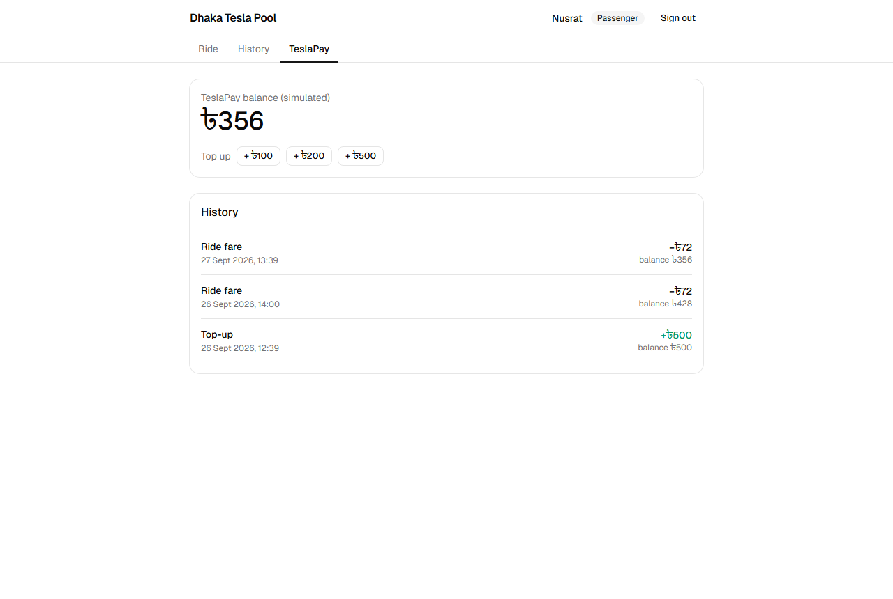 **TeslaPay ledger**: ৳500 − ৳72 − ৳72 = ৳356                                            |

## 4. Architecture

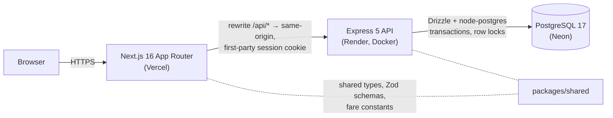

- **One origin for the browser.** Next.js proxies `/api/*` to Express, so the
  httpOnly session cookie is first-party and there is no CORS at all.
- **The API is layered** so every rule has one home:
  `routes` (parse, authorise, validate) → `services` (open the transaction,
  orchestrate) → `domain` (pure decisions: fare, matching, state machines,
  cancellation, timeline wording; heavily unit-tested) → repositories and
  queries (locked SQL).
- **Shared package.** Status enums, Zod schemas and fare constants are defined
  once and used by the form, the API validation and the database enums.
- **No extra infrastructure.** No Redis, queues or WebSockets; the
  "live" screens poll every 3 s. [Section 19](#19-bonus-if-oi-tesla-goes-viral)
  covers what changes at scale.

**Two lifecycles.** A _pool_ is one trip of the car; a _ride_ is one passenger.
They are separate because passengers don't finish together (Nusrat is dropped
off before Rafiq, with her own fare and payment).

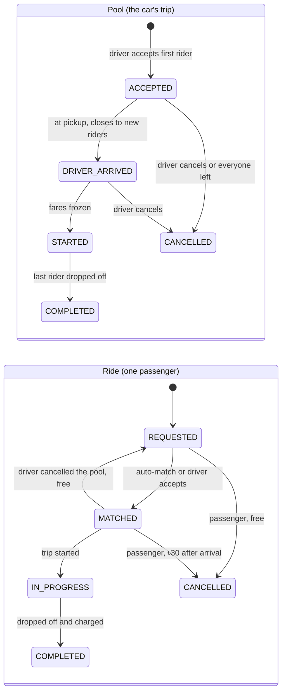

Every transition is checked against an explicit table (`domain/stateMachine.ts`,
an invalid one is a `409 INVALID_TRANSITION`) and writes a `ride_events` row
in the same transaction as the change.

## 5. Database and ERD

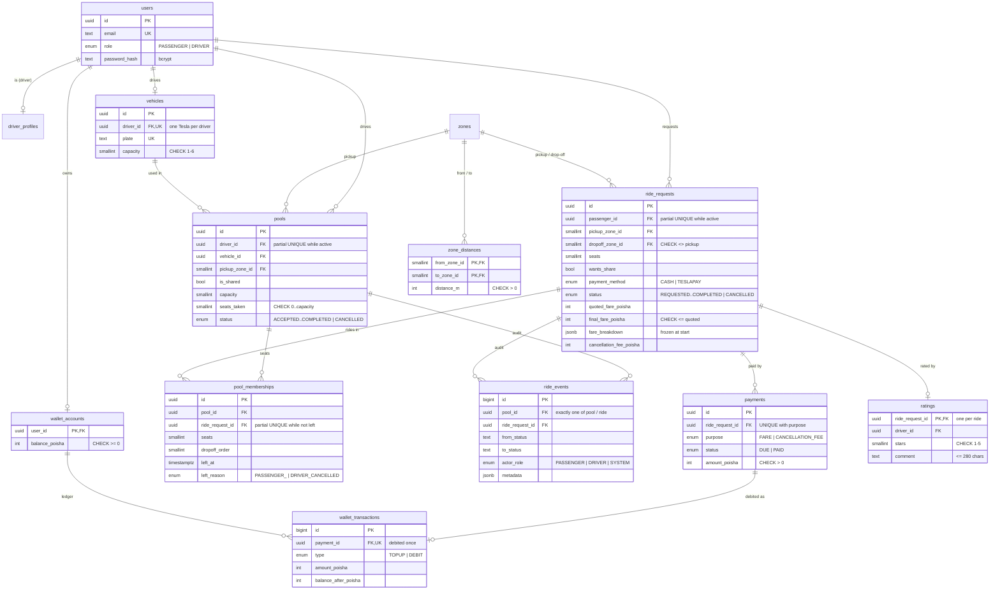

What the constraints guarantee, even if application code is wrong:

| Guarantee                                                            | Enforced by                                                                               |
| -------------------------------------------------------------------- | ----------------------------------------------------------------------------------------- |
| Bullet is never overbooked                                           | `CHECK (seats_taken BETWEEN 0 AND capacity)` on `pools`                                   |
| One active ride per passenger (also stops a double-tapped "Request") | partial unique index on `ride_requests(passenger_id)` while REQUESTED/MATCHED/IN_PROGRESS |
| One active pool per driver                                           | partial unique index on `pools(driver_id)` while active                                   |
| Final fare never above the quote                                     | `CHECK (final_fare_poisha <= quoted_fare_poisha)`                                         |
| TeslaPay never overdrawn, never debited twice                        | `CHECK (balance_poisha >= 0)`, unique `wallet_transactions.payment_id`                    |
| A fare or fee charged at most once                                   | unique `payments(ride_request_id, purpose)`                                               |
| Each audit event is about exactly one thing                          | `CHECK (num_nonnulls(pool_id, ride_request_id) = 1)`                                      |
| Rated at most once                                                   | `ratings` primary key is the ride id                                                      |

**Why a `pool_memberships` table instead of `ride_requests.pool_id`?** When a
driver cancels a pool, its passengers go back to the queue. A plain foreign key
would be cleared and history lost; membership rows are closed with a reason
instead, which is what lets the driver's history say "you cancelled, rider
re-queued" and the passenger's timeline explain what happened.

Migrations are plain SQL generated by drizzle-kit
([`apps/api/migrations`](apps/api/migrations)); indexes follow the hot queries
(waiting requests by pickup, joinable pools by pickup, histories by user).

## 6. Pooling, fares and cancellation rules

**Who can share.** A shared request can join an open shared pool when: same
pickup zone, the pool is still `ACCEPTED` (driver not yet arrived), enough free
seats, and on the **nearest-first drop-off route no rider's trip grows by more
than 2 km**. Candidate pools are tried oldest first.

> Nusrat → Mohakhali (2.5 km) and Rafiq → Gulshan 1 (3.0 km), both from Banani.
> Route: Mohakhali first (2.5), then Gulshan 1 (2.5 + 2.0 = 4.5).
> Detours: Nusrat 0, Rafiq 1.5 km ✅ they share.
> Shirin → Gulshan 2 would go first (1.5), pushing Nusrat to 5.5 km: +3 km ❌.

**Fare** (integer poisha; ৳1 = 100 poisha):

```
subtotal = (৳40 base + ৳20 per km of your own direct distance) × seats
shared   = subtotal − 20% (a pool of 2)   or   − 30% (3+ riders at start)
```

| Rider                      | Direct | Subtotal | Shared (2 riders) | If the Tesla fills up (3) |
| -------------------------- | ------ | -------- | ----------------- | ------------------------- |
| Nusrat, Banani → Mohakhali | 2.5 km | ৳90      | **৳72**           | ৳63                       |
| Rafiq, Banani → Gulshan 1  | 3.0 km | ৳100     | **৳80**           | ৳70                       |

- **Upfront, and it can only drop.** The quote assumes the smallest pool (20%)
  and is honoured even if nobody joins. When the trip starts, each fare is
  re-priced for the riders actually aboard and frozen, never above the quote
  (also a DB CHECK). You pay for your own direct distance, not the detour.
- **Payment at drop-off**, in the same transaction as the drop-off: TeslaPay
  is debited, cash is recorded as collected (the driver sees the amount).

**Cancellation.** Free while waiting or while the Tesla is on its way; **৳30**
once the driver has arrived (TeslaPay pays it at once; a cash fee becomes a
debt collected with the next ride); impossible once riding. A driver cancelling
a pool costs passengers nothing; they go back to the queue.

## 7. Concurrency: the last seat

> Bullet has 1 seat left. Nusrat and Shirin both try to claim it at nearly the
> same instant, and both initially see one seat available.

**How it's handled now:** two layers.

1. **Pessimistic row lock (correct behaviour).** Each booking runs in one
   transaction: read candidate pools _without_ a lock (only a hint), then for
   each candidate `SELECT … FROM pools WHERE id = $1 FOR UPDATE`, re-read the
   pool's current members **after** getting the lock, re-run the whole
   compatibility check, and only then claim the seat. The second request waits
   on the lock, then sees 3/3 and moves on: it stays `REQUESTED` ("still
   looking"), which is a clean outcome, not an error.
2. **Database CHECK (integrity even with a bug).** Seats are claimed with an
   increment, and `CHECK (seats_taken <= capacity)` makes Postgres reject any
   overbooking, whatever the code did.

Why not a single atomic `UPDATE … SET seats_taken = seats_taken + 1 WHERE
seats_taken < capacity`? It protects the count but **not the detour rule**,
which depends on who is in the pool right now, so the pool has to be locked
while that decision is made.

**Deadlocks** are avoided by one global lock order used everywhere:
`driver_profiles → pools → ride_requests → wallet_accounts`. A passenger
cancelling reads which pool to lock first, locks in order, and **retries** if
the ride changed pools in between (instead of locking out of order).

**Proven by tests** ([`last-seat-race.test.ts`](apps/api/test/last-seat-race.test.ts)):
10 rounds of two passengers firing at Bullet's last seat simultaneously;
exactly one gets it, the other stays waiting, and `seats_taken` always equals
the sum of active memberships. **Mutation check:** removing `FOR UPDATE` makes
the test fail in round 1 (the CHECK then rejects the second write with a 500),
so the test really exercises the race. Other races covered: double-tapped
request, double accept, cancel vs start, cancel vs accept, double rating.

**At larger scale** a popular pickup area turns its pools into hot rows. The
plan: partition matching by area (H3 cell) with one matcher worker per cell, so
each area has a single writer instead of lock queues, keep the CHECK as the
backstop, and add idempotency keys. Details in
[docs/scaling.md](docs/scaling.md#3-decisions-and-why).

## 8. Tech choices and why

Frontend (React/Next.js) and backend (Node.js) were mandated; everything else
was chosen for this problem.

| Area         | Choice                                                        | Alternatives                       | Why it fits a ride-pooling MVP                                                                                                         | Would switch when                                                                 |
| ------------ | ------------------------------------------------------------- | ---------------------------------- | -------------------------------------------------------------------------------------------------------------------------------------- | --------------------------------------------------------------------------------- |
| Frontend     | **Next.js 16 App Router**                                     | React + Vite + React Router        | Route groups for the passenger and driver areas; `rewrites` give a same-origin API proxy, so the cookie is first-party; free on Vercel | A native mobile app is needed (React Native, same API)                            |
| Backend      | **Express 5**                                                 | Fastify, NestJS                    | Small, and every layer is written by hand and explainable; Express 5 passes rejected async handlers to the error middleware            | The team grows and wants enforced modules/DI (NestJS) or raw throughput (Fastify) |
| API style    | **REST + explicit commands** (`POST /driver/pools/:id/start`) | GraphQL, tRPC, `PATCH {status}`    | Each transition has its own rules, side effects and audit entry; easy to test with curl and Supertest                                  | Many clients with very different data needs (GraphQL)                             |
| Database     | **PostgreSQL 17**                                             | SQLite, MySQL                      | Row locks, CHECK constraints, partial unique indexes, enums and jsonb: the capacity problem needs real transactional locking           | Never the engine; add PostGIS for geo, read replicas for load                     |
| ORM          | **Drizzle + drizzle-kit**                                     | Prisma, Knex, TypeORM              | Reads like SQL; `.for('update')`, `check()` and partial indexes live in the schema; migrations are readable SQL                        | The team prefers Prisma's DX and accepts raw SQL for locks                        |
| Validation   | **Zod in a shared package**                                   | Joi, backend-only Zod              | One schema validates the form and the request body; types inferred from it                                                             | —                                                                                 |
| Auth         | **bcrypt + JWT (HS256) in an httpOnly, SameSite=Lax cookie**  | Token in localStorage, DB sessions | Not readable by XSS; JSON-only writes + SameSite block CSRF; stateless, no session store                                               | Instant revocation is needed (DB sessions / denylist) or SSO (OIDC)               |
| Live updates | **Polling every 3 s** (TanStack Query)                        | SSE, WebSockets                    | Statuses change on a scale of minutes; no extra infrastructure                                                                         | Many concurrent users (WebSockets via pub/sub)                                    |
| Styling      | **Tailwind + shadcn/ui**                                      | CSS Modules, MUI                   | Accessible components I own; quick, clean loading/empty/error states                                                                   | —                                                                                 |
| Money        | **Integer poisha**                                            | numeric, float                     | Exact arithmetic, trivially testable                                                                                                   | Multi-currency (store currency with amount)                                       |
| Tests        | **Vitest + Supertest on a real Postgres**                     | Jest, mocks, SQLite                | Locks and constraints only mean something against the real engine                                                                      | Add Playwright E2E to CI as the UI grows                                          |
| Hosting      | **Vercel (web) + Render (API) + Neon (DB)**, all free         | Render-only, Supabase, Docker-only | Free with no expiry (Render's free Postgres is deleted after 30 days); Singapore regions, closest to Dhaka                             | Paid tier for no cold starts, or one provider for lower latency                   |
| Monorepo     | **npm workspaces**                                            | pnpm, two repos                    | One source of truth for types/schemas/constants with no extra tooling                                                                  | Build times hurt (Turborepo / pnpm)                                               |
| Logging      | **pino** with request IDs                                     | winston, morgan                    | Structured JSON; one request ID across every log line of a request                                                                     | Ship to a log collector (Loki, Datadog)                                           |

## 9. Project structure

```
apps/
  api/                      Express API (TypeScript, bundled with tsup)
    src/
      app.ts                createApp(): middleware + routers (used by server and tests)
      config/env.ts         env vars validated with Zod at startup (fail fast)
      db/                   Drizzle client, schema/, migrate, seed (+ demo history), reset-demo
      domain/               PURE rules: fare, matching, stateMachine, cancellation, timeline
      modules/<feature>/    routes → service (transactions) → queries/repository (SQL)
      middleware/           auth guards, validation, error handler, security, request log
      lib/                  errors, logger, password, session (JWT), audit events
    migrations/             SQL generated by drizzle-kit (committed)
    test/                   Vitest + Supertest against a real Postgres test database
    start.sh                container start on Render: migrate → seed → server
  web/                      Next.js App Router frontend
    src/proxy.ts            role-based redirects (Next 16's renamed middleware)
    src/app/                (auth)/login, (auth)/register, passenger/…, driver/…
    src/components/         ride/, driver/, wallet/, auth/, ui/ (shadcn)
    src/lib/                API client, TanStack Query hooks, formatting
packages/shared/            types, Zod schemas, enums and fare constants for both apps
docs/                       screenshots, scaling write-up
scripts/screenshots.mjs     plays the demo story in a browser, saves screenshots
docker-compose.yml          db → migrate (one-shot) → api → web, with health checks
render.yaml                 Render Blueprint for the API
.github/workflows/ci.yml    typecheck, lint, format, tests (real Postgres), build
```

## 10. Running it

**Prerequisites:** Docker Desktop (or Docker Engine with Compose). For local
development also Node.js ≥ 22 and npm ≥ 10.

### Option A: everything in Docker (one command)

```bash
git clone https://github.com/shopnil13/dhaka_tesla_pool.git
cd dhaka_tesla_pool
docker compose up --build
```

Open **http://localhost:3000** and sign in with a demo account.

- Order: Postgres (healthy) → `migrate` (one-shot: migrations, then the seed)
  → API (health-checked, not published to the host) → web on port 3000.
- No `.env` is needed: every value has a local-demo default. Copy
  `.env.example` to `.env` to change them.
- Images are multi-stage and run as a non-root user.
- Stop with `docker compose down` (add `-v` to delete the database volume).

### Option B: local development (hot reload)

```bash
npm ci
cp .env.example .env            # then set JWT_SECRET to a random value
docker compose up -d db         # Postgres 17 on localhost:5433 (+ the test DB)
npm run db:migrate -w @teslapool/api
npm run db:seed -w @teslapool/api
npm run dev -w @teslapool/api   # http://localhost:4000
npm run dev -w @teslapool/web   # http://localhost:3000 (proxies /api to :4000)
```

### Migrations and seed

| Command                                   | What it does                                                                                                                                                          |
| ----------------------------------------- | --------------------------------------------------------------------------------------------------------------------------------------------------------------------- |
| `npm run db:migrate -w @teslapool/api`    | Applies pending SQL migrations (tracked, safe to re-run)                                                                                                              |
| `npm run db:seed -w @teslapool/api`       | Idempotent seed: 9 zones + distance matrix, the cast, wallets, and (only on a database with no rides yet) yesterday's shared trip so the history screens aren't empty |
| `npm run db:reset-demo -w @teslapool/api` | Empties every table and re-seeds; use before a demo. Refuses to run with `NODE_ENV=production` unless `ALLOW_DEMO_RESET=true`                                         |
| `npm run db:generate -w @teslapool/api`   | Generates a new migration after a schema change                                                                                                                       |

### Environment variables

See [`.env.example`](.env.example). Never commit a real `.env`.

| Variable                        | Used by          | Meaning                                                             |
| ------------------------------- | ---------------- | ------------------------------------------------------------------- |
| `DATABASE_URL`                  | API              | Postgres connection string (on Neon: `?sslmode=verify-full`)        |
| `DATABASE_URL_TEST`             | tests            | Test database; **its name must end in `_test`** (tests truncate it) |
| `JWT_SECRET`                    | API              | Signs session tokens; at least 32 characters                        |
| `JWT_EXPIRES_IN_HOURS`          | API              | Session length (default 12)                                         |
| `COOKIE_SECURE`                 | API              | `true` when served over HTTPS                                       |
| `TRUST_PROXY_HOPS`              | API              | Proxies in front of the API (for client IPs in rate limiting)       |
| `AUTH_RATE_LIMIT`               | API              | Sign-in / sign-up attempts per 15 minutes                           |
| `PORT`, `LOG_LEVEL`, `NODE_ENV` | API              | Usual meaning                                                       |
| `SEED_DEMO_PASSWORD`            | seed             | Password of the demo accounts                                       |
| `API_URL`                       | web (build time) | Where Next.js proxies `/api/*`                                      |
| `POSTGRES_*`, `WEB_HOST_PORT`   | compose          | Local database credentials and ports                                |

## 11. Tests

```bash
docker compose up -d db     # the tests need the real Postgres (teslapool_test)
npm test                    # 148 API tests
npm run verify              # typecheck → lint → prettier → tests (what CI runs)
```

Vitest + Supertest against a **real Postgres** test database (row locks and
constraints are the point, so no mocks or SQLite). Each test starts from a
freshly truncated and re-seeded world; tests read like the story
(`signedInAs(app, 'nusrat')`, `requestFromBanani('mohakhali')`). A guard
refuses to run against any database whose name doesn't end in `_test`.

| Required behaviour                         | Where it's tested                                                                                                                   |
| ------------------------------------------ | ----------------------------------------------------------------------------------------------------------------------------------- |
| Bullet's capacity can never be exceeded    | `db-constraints` (the CHECK rejects a direct overbooking), `domain/matching`, a consistency check after every pooling scenario      |
| Invalid state transitions are rejected     | `domain/state-machine` (every pair of both machines), `driver-flow` (start before arrive, drop-off before start… → 409)             |
| Nusrat's and Rafiq's pooled fares          | `domain/fare` (৳72 / ৳80, ৳63 / ৳70 / ৳63, never above the quote), `driver-flow` end to end, `fares`                                |
| Users can't modify another user's ride     | `pooling`, `cancellation`, `ride-timeline`, `ratings` (someone else's ride → 404), `auth-guards` (wrong role → 403)                 |
| Cancellation rules hold                    | `domain/cancellation`, `cancellation` (free / ৳30 TeslaPay / ৳30 cash owed / refused once riding)                                   |
| Concurrent requests can't corrupt capacity | `last-seat-race` (10 rounds, mutation-checked), plus cancel-vs-start, cancel-vs-accept, double submit, double accept, double rating |

Also covered: auth and cookie flags, rate limiting, health check, wallet and
ledger integrity, payments at drop-off, timeline wording and privacy, driver
history and earnings, and the seeded demo history. **CI**
([`.github/workflows/ci.yml`](.github/workflows/ci.yml)) runs `verify` and the
production build against a Postgres 17 service on every push and pull request
to `master`, `pre-release` and `release/**`. The UI is checked end to end by
the screenshot script (not in CI).

## 12. API overview

Base path `/api/v1`, JSON only (other content types → 415). Errors always use
one envelope: `{ "error": { "code", "message", "details?", "requestId" } }`.
400 validation · 401 not signed in · 403 wrong role · 404 not found **or not
yours** (so the API never confirms someone else's ride exists) · 409 invalid
transition or conflict · 422 business rule · 429 rate limited.

| Endpoint                                                                            | Who                | What                                                        |
| ----------------------------------------------------------------------------------- | ------------------ | ----------------------------------------------------------- |
| `GET /health`                                                                       | public             | Liveness + database ping                                    |
| `POST /auth/register` · `POST /auth/login` · `POST /auth/logout` · `GET /auth/me`   | public / any       | Session cookie in and out                                   |
| `GET /zones` · `POST /fares/estimate`                                               | public / passenger | Zones; upfront quote + "could drop to"                      |
| `POST /rides`                                                                       | passenger          | Request (auto-matches when sharing)                         |
| `GET /rides` · `GET /rides/active` · `GET /rides/:id`                               | passenger          | Own rides only                                              |
| `GET /rides/:id/events`                                                             | passenger          | Timeline, worded by the API                                 |
| `POST /rides/:id/cancel` · `POST /rides/:id/rating`                                 | passenger          | Cancel (fee rules) · rate once                              |
| `GET /wallet` · `POST /wallet/top-up`                                               | passenger          | TeslaPay balance, ledger, dues · simulated top-up           |
| `GET /driver/profile` · `PATCH /driver/status`                                      | driver             | Online/offline, zone                                        |
| `GET /driver/requests`                                                              | driver             | Waiting requests in my zone with fits / doesn't-fit reasons |
| `POST /driver/requests/:rideId/accept`                                              | driver             | Into my current pool or a new one                           |
| `GET /driver/pool`                                                                  | driver             | Current pool: riders, drop-off order, cash to collect       |
| `POST /driver/pools/:id/arrive` · `/start` · `/cancel` · `/riders/:rideId/drop-off` | driver             | Lifecycle commands (drop-off also charges)                  |
| `GET /driver/history`                                                               | driver             | Finished trips, earnings, ratings                           |

State changes are **commands** (`POST …/start`) rather than `PATCH {status}`:
each has its own preconditions, side effects (fare freeze, payment) and audit
entry.

## 13. Deployment

| Part     | Where                                           | Notes                                                                                                                                                                                                                                                                                                                    |
| -------- | ----------------------------------------------- | ------------------------------------------------------------------------------------------------------------------------------------------------------------------------------------------------------------------------------------------------------------------------------------------------------------------------ |
| Web      | **Vercel** (Hobby, free)                        | Root directory `apps/web`; env `API_URL` = the Render URL; `/api/*` is proxied, so the cookie stays first-party                                                                                                                                                                                                          |
| API      | **Render** free web service (Docker, Singapore) | Defined in [`render.yaml`](render.yaml). Pre-deploy commands are paid-only, so [`start.sh`](apps/api/start.sh) runs migrations and the idempotent seed before the server on every start. Health check pings the database, so a broken deploy never replaces the live one. Redeploys on every commit to the deploy branch |
| Database | **Neon** free Postgres (Singapore)              | Direct connection with `sslmode=verify-full`; does not expire (Render's free Postgres would be deleted after 30 days)                                                                                                                                                                                                    |

**Free-tier behaviour:** Render sleeps the API after 15 idle minutes; the next
request waits ~1 minute (Vercel's proxy allows 120 s, so it doesn't fail) and
the UI explains the wait. Neon's database also scales to zero after 5 idle minutes
and wakes again on the next query, far faster than the API.

**Resetting the live demo data** (e.g. before recording): run the reset from a
laptop against the Neon database (the value is in Render → Environment; don't
commit it):

```bash
DATABASE_URL="<neon connection string>" npm run db:reset-demo -w @teslapool/api
```

## 14. Key decisions and trade-offs

- **Row lock + CHECK over a clever atomic UPDATE.** Slightly more code and a
  lock held for a few milliseconds, in exchange for being able to check the
  detour rule against the current members. The CHECK makes it safe even if a
  future code path forgets the lock.
- **Upfront price that can only drop.** Passengers know the maximum before
  they book; when the car fills up, everyone gets the bigger discount. The
  business absorbs the 20% on pools that end up with one rider.
- **Zones and a distance matrix instead of maps.** Exact, testable fares and
  no map API, at the cost of realism. The matching rule (same pickup + detour
  limit) carries over to real routing unchanged.
- **Polling instead of WebSockets.** No extra infrastructure and simple
  failure modes; costs extra requests and up to 3 s of staleness.
- **Stateless JWT cookie.** No session store and trivial horizontal scaling;
  a session can't be revoked before it expires (12 h).
- **Separate pool and ride lifecycles.** More tables and states, but each
  passenger gets their own completion, fare, payment and history.
- **The API writes the timeline text.** One place decides what a passenger
  may read (nothing about other riders), at the cost of English-only,
  server-side wording.
- **Cash late fees become a debt** collected with the next ride, because you
  can't collect cash from someone who isn't getting in.

## 15. Known limitations

- Geography is 9 zones with invented distances; no maps, live traffic or GPS.
- Unmatched requests never expire, and there is no passenger no-show flow.
- Drivers are seeded; there is no driver sign-up or vehicle onboarding, and
  there is one driver in the demo.
- Status updates arrive by polling (up to 3 s late).
- Sessions can't be revoked early (stateless JWT); sign-out clears the cookie.
- Sign-in is rate-limited per account. The per-IP sign-up limit sees proxy
  addresses in production (Vercel → Cloudflare → Render), so it acts as one
  shared limit there.
- Free hosting: ~1-minute cold start after idling, and migrations + seed run
  on each start (a few seconds).
- Cash is recorded as paid when the driver drops the passenger off; there is
  no dispute flow. A cash late fee counts as the driver's earning while it is
  still owed.
- No frontend unit tests; the UI is covered by the end-to-end screenshot
  script, which is not part of CI.
- The demo password is public on purpose.

## 16. Next improvements

Real maps and routing (H3 cells + a routing service) · request expiry and
no-show handling · WebSockets/SSE for live status · `Idempotency-Key` on
booking, accept, drop-off and top-up · Playwright flow in CI · driver
onboarding and more than one driver in the demo · refresh tokens with
revocation · a real payment provider (bKash/SSLCommerz) with webhooks and
reconciliation · push/SMS notifications · an admin view of pools and events.

## 17. Git workflow

- **`feature/*`**: one branch per logical feature, incremental
  [conventional commits](https://www.conventionalcommits.org/), merged into
  `master` with `--no-ff` once working and tested: `project-setup` →
  `database-schema` → `passenger-auth` → `docker-setup` → `fare-engine` →
  `tesla-pooling` → `driver-flow` → `payments` → `ride-history`.
- **`master`**: the integrated MVP.
- **`pre-release`**: cut from `master` for integration fixes, CI, deployment
  checks and documentation (the deployment fixes are in its history).
- **`release/v1.0.0`**: cut from `pre-release`, tagged `v1.0.0`; the version
  that is deployed and shown in the video.

## 18. AI usage

**Tool:** Claude Code (Anthropic), used as a pair programmer throughout, with
the design decisions made by me.

**What for:** turning the brief into a plan through a question-and-answer
session where I chose each option (stack, matching rule, pricing, payments,
cancellation, hosting); implementing features and tests; reviewing edge cases;
writing documentation; and debugging the deployment through the Render and
Vercel dashboards' APIs.

- **Accepted:** use **Drizzle instead of Prisma**, because row locks
  (`.for('update')`), CHECK constraints and partial unique indexes are
  first-class in its schema, and the generated migrations are readable SQL.
- **Changed:** it suggested **freezing each fare when the trip starts**. I
  wanted passengers to see a price before booking, so we combined the two:
  quote up front at the 2-rider discount, re-price at start, and never charge
  more than the quote (enforced by a CHECK).
- **Rejected:** an **atomic conditional `UPDATE`** to claim seats. It protects
  the count but not the 2 km detour rule, which depends on who is in the pool,
  so I kept the row lock with a re-check under the lock.

**How I verified instead of trusting:** the race test was checked by deleting
the lock and watching it fail; testing through the real Next.js proxy exposed
that it doesn't forward client IPs, so the per-IP login limit was one shared
bucket (fixed: per-account limit, a separate `fix(auth)` commit); an
integration test caught the timeline reading a late fee from the wrong field
even though the unit tests passed; and the first Render deploy failing with
exit 127 led to the `start.sh` fix. I can explain and change every part of the
code.

## 19. Bonus: if Oi Tesla goes viral

1M passengers and 100k drivers is ~150 bookings/s at peak but ~7.5k driver
location updates/s and ~100k live status watchers, so the pressure points are
location churn, push updates and hot pickup areas, not raw request volume.
The plan, with a diagram and the reasoning for each piece (load balancing,
horizontal scaling, read replicas and sharding, H3/Redis geo search, an event
log partitioned by pickup cell with one matcher per cell, WebSockets,
rate limiting, idempotency keys, outbox and retries, observability, security
and canary deploys), is in **[docs/scaling.md](docs/scaling.md)**.

---

Licensed under the [MIT License](LICENSE).
