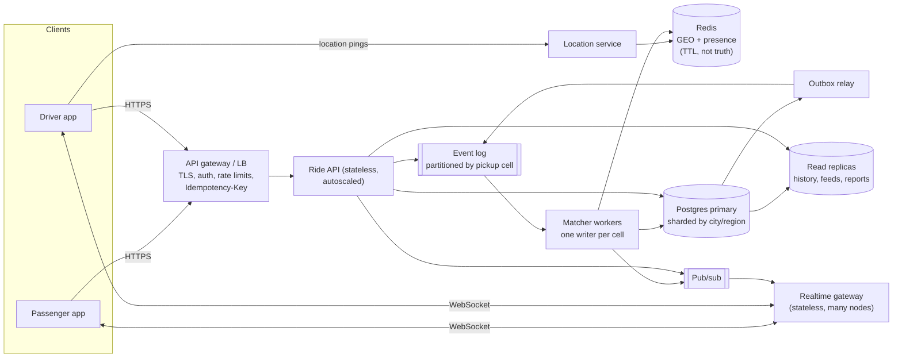

# If Oi Tesla goes viral: 1M passengers, 100k drivers

The MVP is one Express process and one Postgres, and that is the right size for
it. This is how I would grow it, in the order the pain would actually arrive,
without pretending the MVP needs any of it today.

## 1. Size the problem first

Rough numbers, so each decision below has a reason:

| Quantity                                 | Estimate                                      | Why it matters                                                                  |
| ---------------------------------------- | --------------------------------------------- | ------------------------------------------------------------------------------- |
| Rides per day                            | 1M passengers × ~1.5 rides/day ≈ **1.5M/day** | ~17 requests/s on average, **~150/s at the evening peak** (×8–10 over the mean) |
| Drivers online at peak                   | ~30% of 100k ≈ **30k**                        | the matching pool                                                               |
| Driver location updates                  | 30k × one every 4 s ≈ **7.5k writes/s**       | the biggest write stream, and it is _not_ business data                         |
| Live status watchers                     | ~100k open apps at peak                       | polling every 3 s would be ~33k req/s of mostly "nothing changed"               |
| Bookings per popular pickup cell at peak | a few per second                              | contention on the _same_ pools, not global load                                 |

Two conclusions: raw request volume is modest, and the hard parts are
**location churn**, **push updates** and **contention on hot pickup areas**.
The seat-capacity problem the MVP solves with a row lock stays the heart of it.

## 2. Target architecture

## 3. Decisions, and why

**Load balancing and horizontal scaling.** The API is already stateless (JWT
in a cookie, no in-memory sessions), so it scales by adding instances behind a
load balancer, with autoscaling on CPU and p95 latency. The zone/distance data
it caches is static and small. WebSocket connections move to a separate
realtime tier so API deploys do not drop them.

**Geospatial search.** Nine hand-made zones become **H3 hexagons** (or
geohashes). Driver positions live in **Redis GEO** with a short TTL, so a
driver who stops pinging disappears on their own. Redis is a cache of _where
drivers are right now_; Postgres stays the source of truth for rides, seats
and money. The "same pickup" rule becomes "same or neighbouring cell", and the
distance matrix becomes a routing service (OSRM or a maps API) with cached ETAs
per cell pair.

**Ride matching and DB contention.** Today every booking locks the candidate
pool row (`SELECT … FOR UPDATE`) and a CHECK constraint backs it up. At scale
the same idea is kept but _organised_:

- Requests are published to an event log **partitioned by pickup cell**. One
  matcher worker owns each partition, so each hot area has **a single writer**
  and bookings for the same pool are applied one after another without queuing on
  a database lock.
- The matcher can **batch** a second or two of requests per cell and solve
  them together (better pools than first-come-first-served).
- The row lock and `CHECK (seats_taken <= capacity)` stay as the backstop: even
  if two workers ever overlapped during a rebalance, the database still refuses
  an overbooking.

**Database.** Indexes already follow the hot queries (waiting requests by
pickup, joinable pools by pickup, history by passenger). Next steps, in order:
connection pooling (PgBouncer), **read replicas** for history, feeds and
analytics, partitioning `ride_events` by month (it is append-only and grows
fastest), then **sharding by city/region**, since a ride never spans cities.
Money tables (payments, ledger) stay on the primary with their constraints.

**Caching.** Static data (zones/cells, fare constants) at the edge and in
process. Per-user "active ride" views are short-lived caches invalidated by
events. Nothing that decides seats or money is served from a cache.

**Queues and events.** State changes write their audit event and an **outbox**
row in the same transaction (the MVP's `ride_events` already works this
way); a relay publishes them. Consumers (notifications, payments, analytics,
realtime push) are independent and idempotent, so one failing does not block a
booking.

**Real-time communication.** Polling every 3 s is fine for an MVP and
wasteful at 100k watchers. Replace it with **WebSockets (or SSE)** through a
pub/sub fan-out: a ride's status change is pushed only to its passenger and
driver. Clients keep a slow poll as a fallback when the socket drops.

**Rate limiting.** At the gateway, per user and per IP, with separate
budgets for sign-in, booking and location pings (drivers ping often by design).
The MVP's per-account login limit becomes a shared counter in Redis so it holds
across instances.

**Idempotency.** Mobile networks retry. `POST /rides`, accept, drop-off and
top-up take an **Idempotency-Key**, and the result is stored for 24 h so a
retried request returns the first answer instead of acting twice. The MVP already has
database-level guards (one active ride per passenger, one debit per payment,
one rating per ride); the key makes retries return the same answer instead of a
conflict.

**Retry and failure strategy.** Retries with exponential backoff and jitter,
only for idempotent operations; circuit breakers around maps and payment
providers; a dead-letter queue for events that keep failing. If matching is
degraded, requests still enter the driver feed (the MVP's fallback path).
Payments settle asynchronously with reconciliation against the provider.

**Observability.** Structured logs with a request ID (the MVP already uses
pino with request IDs), **OpenTelemetry traces** across API → matcher →
database, RED metrics per endpoint, business metrics (match rate, time to
match, cancellations, overbooking attempts rejected by the CHECK, which
should be zero) and SLOs with alerts on p95 latency and error budgets.

**Security.** Secrets in a secrets manager and rotated; WAF and bot
protection at the edge; short-lived access tokens with refresh and revocation
(the MVP's stateless JWT cannot be revoked early); least-privilege database
roles; PII (phone, location history) encrypted and retained only as long as
needed; audit trail kept (already `ride_events`).

**Deployment strategy.** Containers on a managed orchestrator, one
deployment per service, **blue-green or canary** releases with automatic
rollback on SLO breach, backward-compatible database migrations
(expand → migrate → contract), feature flags for risky changes (e.g. a new
matching algorithm on 5% of cells first).

## 4. What I would _not_ do yet

No microservices for their own sake: the first split is only the one with a
real reason (location/realtime traffic is a different shape from bookings).
No Kafka before one queue is actually busy. The MVP's rule of thumb still
holds at scale: correctness lives in the database (constraints, locks,
transactions), and everything else is there to keep that database from being
the bottleneck.
